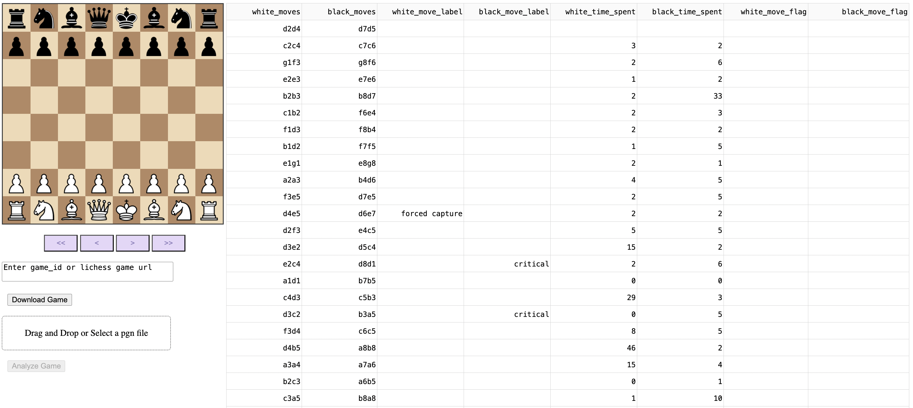

# check_suspicious_games

This is a work-in-progress app that locates and downloads a lichess pgn through the lichess API, then analyzes move times and evaluation changes to flag suspicious moves or behavior.

## Background

Although average centipawn loss is a metric to help flag potential cheaters, it will only work for the most obvious cases where a person uses assistance on [nearly] every move. Players who want to evade cheat detection will typically either (1) mix their own moves with computer moves, or (2) examine computer moves and select suboptimal choices. I will mention in passing that a genuinely strong player who uses computer assistance to cheat infrequently enough (e.g. using a computer every few games, at only a small number of critical points) is essentially undetectable. However, putting this edge case aside, most players using computer assistance are not simply not strong enough to judge the degree to which moves are obvious to strong players, and this is often how strong players facing cheaters will sense something is off. The purpose of this app is to help classify and label suspicious moves based on criterion we will go through in the next section.

## Methods

There are few hallmarks of cheating that this app attempts to flag from [online] games: (1) unusually long think times for obvious moves, (2) unusually consistent think times for critical moves. Neither of these things are conclusive, but this app is meant to be a tool to help users report games they believe are suspicious, and provide more in depth move classification than lichess computer analysis.

## Installing Dependencies
To install dependencies, run the following command:
```bash
pip install -r requirements.txt
```

## App Layout Design
- moves on the board are controlled by forward and backward arrows
- display moves and labels using a table, possibly add comments

## Running the App
To run the app locally, cd into the root directory and then run the command:
```python app/app.py```

The app is currently still under development, so this is just a prototype with extra data that won't be typically shown to the end user.



## Tests
To execute unit tests, run the following command:
```bash
pytest -s tests/*.py
```

## App Features
- The [Analyze Game] button will be disabled until a valid pgn is loaded
- To load a pgn, the user can either manually download the game with timestamps, and upload it into the app, or supply the lichess game id, which will prompt the app to fetch the pgn using an API call to lichess
- Once a valid pgn is loaded, the [Analyze Game] button will become active, and once the user clicks the button and the analysis completes, the button will become disabled again to avoid accidentally analyzing the same game again
- When analysis is completed, the board and move buttons will become active, allowing the user to click through the game
- At the same time, two tables will appear: (1) a table displaying move by move analysis with think times, classifications of moves (critical, forced reacpture, etc), and moves flagged as suspicious, and (2) a summary table displaying analysis of critical moves, including average think time and coefficient of variation for think time (standard deviation relative to mean). these metrics are still being refined

## Open Issues
### Methods + Limitations
- have a relative threshold for move times (what constitutes a "long" think time for an obvious move?) currently it's an absolute threshold of 5 seconds which is very rigid. it should at the very least depend on time control, where we allow for longer think times for longer games
- what is the threshold for mean, and coefficient of variation (stdev / mean) for think time on critical moves? is it relative or absolute? current idea is "fast" and consistent think moves for critical moves should be flagged
- false positives are unavoidable. someone can play relatively quickly and consistently, and make all of the right choices on critical moves. however, this shouldn't really be possible for multiple games unless the player ie exceptionally strong
- a more correct way to determine thresholds would be to download at least 100 sample games where people have cheated, and another 100 sample games where people haven't cheated, and do an analysis of all metrics we are using [average think time on forced moves, average think time on all classes of forced moves (forced recapture, forced only legal move, other "forced" moves), coefficient of variation of think times]. use a small training data set to generate default thresholds.

### UI + Tests
- fix tests so that we can mock returning a pgn from lichess API, but don't make a GET request every time we run a test
- thorough tests from preloaded pgns to serve as training for basic suspicious move detection
- check whether a game is blitz, rapid, or classical. bullet game analysis is probably not reliable
- check that timestamps are included, throw an error if not (or provide analysis without timestamps, but this is much less reliable)
- possible issues analyzing a pgn when a player resigns on the opponent's move

